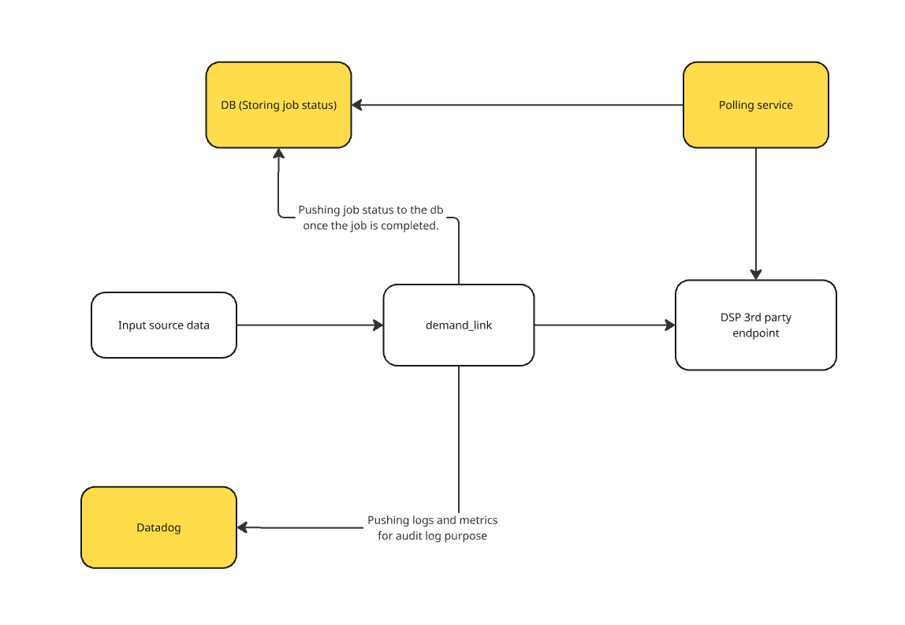

# FunnelFuel Enginnering Challenge
## Overview
This is the project to the FunnelFuel challenge. It demostrates an integration service that submit challenge campaign data to a 3rd-party DSP API, it include most of the real-world constraints such as:
* Rate limites
* Scalability
* Dependency chaining( eg: campaign -> Ad Group -> Ads)
* Error handling and retry logic.

## Tech Stack
| Component | Tech |
|---|---|
| Languange | Python 3.10+ |
| Async Framework | asyncio |
| HTTP Client | aiohttp |
| Rate Limiting | aiolimiter |
| Task Queue | asyncio.Queue |
| Theards | Python threading |
| Testing | pytest |

## High-Level Architecture

This the high level of the demmand_link component architecture.


## How it works:
1. The Python script supports loading either:
   - A **CSV file**
   - A **single campaign record** in dictionary format, eg:
   ```
   {
    "campaign_id": "cmp_2025_004",
    "campaign_name": "Autumn Styles 2024",
    "campaign_budget": 21000,
    "start_date": "2024-09-01",
    "end_date": "2024-10-15",
    "objective": "video_views",
    "ad_groups": [
        {
            "id": "ag_1003",
            "name": "Adults - City",
            "bid": 4.0,
            "targeting_ages": "35-44;45-64",
            "targeting_interests": "fashion;streetwear",
            "targeting_geo": "UK;IE",
            "ads": [
                {
                    "id": "ad_6001",
                    "type": "video",
                    "creative_url": (
                        "https://cdn.example.com/creatives"
                        "/autumn_style_city.jpg"
                    ),
                    "click_url": "https://shop.example.com/city-autumn",
                    "status": "new",
                }
            ],
        }
    ],
    }
   ```

   ### a. **Loading CSV File**
   Each line in the CSV is parsed into a `Record` object. As the script processes each row, it groups related `ad_groups` and `ads` under the corresponding campaign, or creates a new campaign entry if one doesn't exist.

   ### b. **Loading a Single Record (Dict Format)**
   The dictionary is directly converted into a `Record` object.

2. Once a list of `Record` objects is created, the jobs are divided across N worker threads (default: 3; configurable via `--worker`).

3. Each thread runs its own `asyncio` event loop, owns a `ClientSession`, and maintains an independent queue.

4. Each job follows this DSP submission sequence:
   - `POST /campaigns`
   - `GET /campaigns/<id>/status`
     Waits for a response:
     - `{ "status": "success" }` → campaign was created successfully
     - `{ "status": "failed" }` → campaign creation failed; retry up to 3 times before skipping
   - `POST /ad-groups`
     - Expects response to contain an `ad_group_id`
     - If missing, raises an exception
   - `GET /ad-groups/<id>/status`
     - Follows same success/failure handling as above
   - `POST /ads`
     - Expects response to contain an `ad_id`
     - If missing, raises an exception
   - `GET /ads/<id>/status`
     - Verifies the ad status

5. All requests are rate-limited using `AsyncLimiter` (40 requests per minute).

6. Failed jobs are retried up to `MAX_RETRIES`.

---


## Running the project
### Install Dependencies
```bash
# Make sure poetry is available in your environment.
poetry install

```
### Running simple and dummy mock DSP API
```bash
uvicorn scripts.mock_dsp_api:app --reload --port 8000
```

### Run the submission enginer
```bash
python demand_link/demand_link/main.py --file dsp_merged_data.csv
# or
python demand_link/demand_link/main.py --line  '{"campaign_id": "cmp_2025_004", "campaign_name": "Autumn Styles 2024", "campaign_budget": 21000, "start_date": "2024-09-01", "end_date": "2024-10-15", "objective": "video_views", "ad_groups": [ { "id": "ag_1003", "name": "Adults - City", "bid":4.0, "targeting_ages": "35-44;45-64", "targeting_interests": "fashion;streetwear", "targeting_geo": "UK;IE", "ads": [ { "id": "ad_6001","type": "video","creative_url": "https://cdn.example.com/creatives/autumn_style_city.jpg", "click_url": "https://shop.example.com/city-autumn", "status": "new" }]}]}'
```

### Run mocked script to generate dummy data csv file
```bash
# The 'dsp_merged_data.csv' should be save at the directory where you run the generate_test_csv.py
python scripts/generate_test_csv.py
```

### Run Tests
```
pytest -s
```

The script does have the option to change some of the parameters:
```
~/funnel_fuel$ /home/jenny/funnel_fuel/.venv/bin/python /home/jenny/funnel_fuel/demand_link/demand_link/main.py --help
usage: main.py [-h] [--log {DEBUG,INFO,WARNING,ERROR,CRITICAL}] (--line LINE | --file FILE)
               [--rate-limit RATE_LIMIT] [--endpoint ENDPOINT] [--worker WORKER]

Submission Campaign data

options:
  -h, --help            show this help message and exit
  --log {DEBUG,INFO,WARNING,ERROR,CRITICAL}
                        Enabled logging
  --line LINE           Dict of campaign data to process
  --file FILE           Full path for the CSV file of campaign data
  --rate-limit RATE_LIMIT
                        Rate Limit to restrict the request limit to the DSP Endpoint
  --endpoint ENDPOINT             The URL of the DSP API endpoint.
  --worker WORKER       The number of worker to the queue..
```


## Extension & Improvements

This is a working prototype with extensible architecture. Potential improvements:

- **Authentication Support**
  Easily add support for API tokens or Basic Auth in the `Notifier`:
  ```python
  self.auth_dsp = aiohttp.BasicAuth(user, password)
  self.api_header = {"Authorization": "Bearer <API_KEY>"}
  ```

- **Finalization Hook**
  After submission, the `complete_task(...)` method can:
  - Save job status to a DB
  - Report to an external system

  ```python
  async def complete_task(self, is_success, job_id):
      ...
  ```

- **Error Handling Enhancements**
  More granular handling for DSP error codes and timeouts can be added.

---

## 📈 Future Architecture

Here’s a high-level diagram for future system enhancements.
🟡 Yellow components are planned/optional:



---

## Logging

Application logs can be sent to Datadog using the [Datadog Python logging integration](https://docs.datadoghq.com/logs/log_collection/python/). A Datadog agent can forward logs automatically while the script is running.

## Challenges Encountered

- **Rate-limiting across threads**
  Ensuring that all threads respect a shared global rate limit (40 requests/min) required careful separation of `AsyncLimiter` instances per thread.

- **Asyncio event loops in threads**
  Each worker thread needed its own event loop. Mixing `asyncio.Queue` across threads caused runtime errors, so per-thread queues were used.

- **Dependency ordering**
  Campaigns, ad groups, and ads must be submitted in order, with polling after each step. This required designing a job orchestration flow with validation gates.

- **Graceful shutdown**
  Long-running `while True` loops had to be broken cleanly using sentinel values (`"STOP"`) and task tracking with `queue.task_done()`.

- **Testability of aiohttp**
  To unit test HTTP flows, `aiohttp.ClientSession` was injected and manually closed using `async with` patterns to allow mocking in `pytest-asyncio`.

- **Input data structure format and source input**
  Designing the mock structure of campaign data for testing involved making assumptions and conducting research on expected DSP formats, due to the lack of a formal specification.


---
