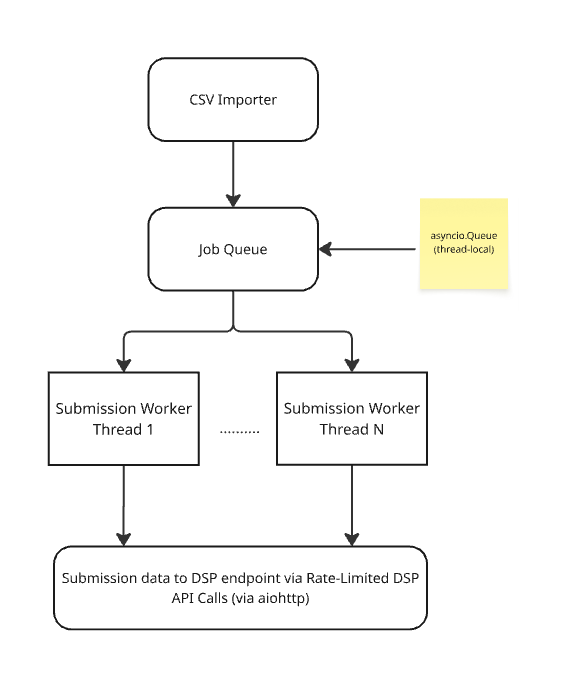

# FunnelFuel Enginnering Challenge
## Overview
This is the project to the FunnelFuel challenge. It demostrates an integration service that submit challenge campaign data to a 3rd-party DSP API, it include most of the real-world constraints such as:
* Rate limites
* Scalability
* Dependency chaining( eg: campaign -> Ad Group -> Ads)
* Error handling and retry logic.

## Tech Stack
| Component | Tech |
|---|---|
| Languange | Python 3.10+ |
| Async Framework | asyncio |
| HTTP Client | aiohttp |
| Rate Limiting | aiolimiter |
| Task Queue | asyncio.Queue |
| Theards | Python threading |
| Testing | pytest |

This the high level of the demmand_link component architecture.


## How it works:
1. The python script support loading CSV file or process one campaign data (in dict format).
    * Loading CSV file
        it will load each lines of the data from the CSV file. The data will be process and convert each campagain as a "Record" object, as it processing each line of campagin data, it will group the *ad_groups* and *ads* to any existing *campaign* before create a new entry.
    * Loading single line (dict format)
        It will convert the dict into the *Record* object.

2. Once the list of *Record* object successfully created, jobs will be divided across N worker threads (default is 3 worker threads but configurable via the argument)
3. Each thread  runs its own asyncio envent loop, ```aiohttp.ClientSession``` and has it owns Queue.
4. Each job is processed by making DSP API endpoint:
    * ``` POST /campaigns ```
    * ``` GET /campaigns/<id>/status ``` and wait for the response from the DSP server. If the status returns:
        - ``` { "status": "success" }``` - this means successfully create campaign data
        - ``` { "status": "failed" } ``` - this means failed to create campaign data. It will raise exception and try again for 3 attempts before process next campaign data.
    * ``` POST /ad-groups ``` and wait for the response.
        - A successful request, it will expecting the reply will contain the *ad-groups-id" key in the dict response.
        - If not, it will assume the post request is failed and raise exeception.
    * ``` GET /ad-groups/<id>/status ``` and wait for the response from the DSP server. If the status returns:
        - ``` { "status": "success" }``` - this means successfully create campaign data
        - ``` { "status": "failed" } ``` - this means failed to create campaign data.
    * ``` POST /ads ``` and wait for the response.
        - A successful resquest, it will expecting the reply will contain the *ads-id" key in the dict response.
        - If not, it will assume the post request is failed and raise exeception.
    * ``` GET /ads/<id>/status ``` and wait for the response from the DSP server. If the status returns:
        - ``` { "status": "success" }``` - this means successfully create campaign data
        - ``` { "status": "failed" } ``` - this means failed to create campaign data.
5. All requests are rate-limited (40 requests/min) using ```AsyncLimiter```.
6. Any failed request or jobs, they will be retired up to ```MAX_RETRIES``.


## Running the project
### Install Dependencies
```bash
# Make sure poetry is available in your environment.
poetry install

```
### Running simple and dummy mock DSP API
```bash
uvicorn scripts.mock_dsp_api:app --reload --port 8000
```

### Run the submission enginer
```bash
python demand_link/demand_link/main.py --file <your mocked csv full path>/dsp_merged_data.csv
```

### Run mocked script to generate dummy data csv file
```bash
# The 'dsp_merged_data.csv' should be save at the directory where you run the generate_test_csv.py
python scripts/generate_test_csv.py
```

### Run Tests
```
pytest -s
```
